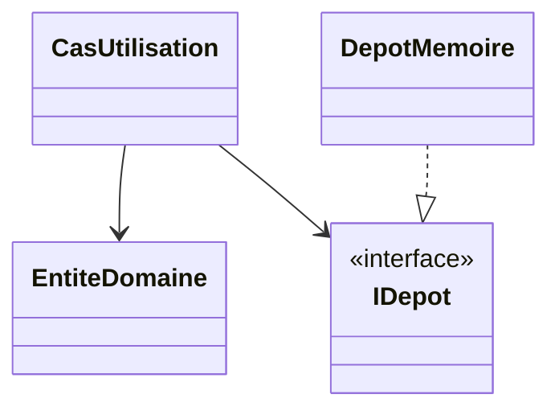

# Diagramme du TP01 — 5 points communs

Compléter un diagramme Mermaid montrant les lots requis : Commandes et Menu pour un binôme, plus Réservations pour une équipe de trois. Chaque personne prépare et identifie la partie concernant son lot; la revue des autres parties est attribuée au journal.

Pour chaque lot, montrer ses classes, interfaces, propriétés, comportements et relations, puis le sens des dépendances de projets. Ajouter les cardinalités sur les associations lorsqu'elles ont un sens; aucune cardinalité sur héritage, réalisation ou dépendance. Les propriétés C# peuvent être annotées `«get»`, `«set»` ou `«private set»`.

Ce schéma est un point de départ à compléter, pas le diagramme final du TP. Infrastructure implante le contrat consommé par Application; le domaine ne dépend d'aucune autre couche. La présentation reçoit les DTO et la racine de composition connaît les implantations techniques. Aucun lot ne dépend d'un projet d'un autre lot. Une zone commune métier n'est pas requise.
